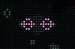

WebGL2 Conway's Game of Life
============================

This is my take on [Conway's Game of Life](https://www.conwaylife.com/wiki/Conway%27s_Game_of_Life). If you'd like to
jump into the code, all the interesting stuff happens in [this shader](./shaders/gol-step.frag).

## Controls
```
[double click]            fullscreen (recommended)
[space]                   pause / resume
[down]                    decrease speed
[up]                      increase speed
[left]                    decrease dead cell brightness
[right]                   increase dead cell brightness
[shift]+[left]            decrease dead cell saturation
[shift]+[right]           increase dead cell saturation
[ctrl]+[left]             decrease alive cell brightness
[ctrl]+[right]            increase alive cell brightness
[ctrl]+[shift]+[left]     decrease alive cell saturation
[shift]+[shift]+[right]   increase alive cell saturation
[shift]+[-]               decrease cell size (reset universe)
[shift]+[+]               increase cell size (reset universe)
[h] or [?]                toggle help
[r]                       restart universe (same entropy)
[shift]+[r]               reset universe (new entropy)
[t]                       toggle rendered texture
[u]                       toggle UI
```

## Additional Features

### "Big Bang" start to the universe
The universe starts as a single point, and expands at a rate of one cell per generation in every direction.

This came out of some work to design a massively distributed GoL universe. Due to the state of each cell
being impacted by its immediate neighbors, unless the universe size was constrained, the impact of each cell's state
could potentially expand the universe's size by a rate of one cell per generation, in every direction. (See:
[speed of light](https://www.conwaylife.com/wiki/Speed))

A GoL universe that exists as only a single point has a problem though: the rules of GoL determine the next state of a
cell by counting the "alive" cells surrounding it, and a single point universe has no neighbors. In other words,
in a GoL universe, time cannot tick for a cell without a full set of neighbors.

A solution is to surround the universe with, for lack of a better name, an "event horizon". The event horizon is a
single cell wide boundary of the universe, in which cells have state, but time does not tick due to lacking a full set
of neighbors. This gives the single universe point in generation 0 a full set of neighbors to tick against.

But what determines the initial state of the cells in the horizon? If their initial state is null, the universe will 
consist only of dead cells. To make the GoL universe interesting, each cell starts with a random state. (See:
[soup](https://www.conwaylife.com/wiki/Soup)) Because the cells in the event horizon need to already have their state
set for the cells at the inside edge of the universe to determining their next state, the initial cell state needs to be
set at least one generation before the cell is part of the event horizon. Entropy is pushed/pulled into the outer edge
of the universe, one cell beyond the horizon.

Based on that, each cell needs to exist for two generations, before it can start ticking. The first generation it is
created, and has its initial state randomly set. The second generation its state doesn't change, because it doesn't have
any neighbors in the direction away from the center of the universe. Since it existed with a state in the last
generation though, it does allow its neighbors toward the center to tick, by providing its state.

#### Generation -2
Because the first cell needs two generations before it starts ticking, and the universe should start ticking at
generation zero, the game starts at generation -2. As the game runs, there will be a square ring two cells wide, of
non-ticking cells going through their initialization phase. In this implementation, instead of an infinitely expanding
universe, a screen sized [torus](https://www.conwaylife.com/wiki/Torus) is used. As a result, the universe boundaries
collide once the edge of the torus is reached.

So let's define a few things that fall into place with an infinitely expanding universe that starts from nothing:
```
universe_edge_dist = generation;              // distance from the universe's center, to the edge of where time ticks
universe_edge_length = 2 * generation + 1;    // universe starts as a single point, and expands at the speed of light
event_horizon_dist = universe_edge_dist + 1;  // distance to the universe boundary, state exists, but time doesn't tick
entropy_dist = event_horizon_dist + 1;        // distance to where the initial state is being injected into the universe
```

At generation -2, the universe has a negative size, so it doesn't yet exist. The distance to the horizon is -1, just on
the other side of the universe, pushing/pulling the first cell's worth of entropy into the universe. The distance to where entropy is injected is 0, so the first cell has its initial state set.

#### Generation -1
At generation -1, the universe still has a negative size, so there's nowhere for time to tick. The event horizon has
just entered the universe at the center, and a ring of entropy is injected around that single point.

#### Generation 0
The universe now has a size of 1, and because that single cell now is surrounded by neighboring event horizon cells, it
is able to start ticking. From here on out, within the boundaries of the universe, the game runs normally.

#### Side note: injecting 100% alive cells
When tweaking the universe so that each cell has a 100% chance of starting out alive, an
[interesting pattern emerges](https://gameoflife.space/#alive=1&size=2&speed=-1).

### Cells inherit color
In addition to an on/off state, each cell also stores a hue angle as a 2D unit vector. When a new cell is born, it
inherits the color of its three parents, by summing and normalizing their hue vectors. A 2D vector is used instead of
storing the hue angle as a single number, to simplify handling the 360/0&deg; boundary.

It turns out somebody else built this same feature and solution several years before I did, and did a nice job of
[documenting it in more detail](https://jimblackler.net/blog/?p=384).

### Oscillator detection
Some lifeforms form [oscillators](https://www.conwaylife.com/wiki/Oscillator), most frequently
[blinkers](https://www.conwaylife.com/wiki/Blinker), which oscillate at a period of 2. Other common oscillators have
[periods as high as 15](https://www.conwaylife.com/wiki/Pentadecathlon). Detecting oscillators as separate from
non-oscillating lifeforms allows for other features, like [Active lifeform highlighting](#active-lifeform-highlighting)
and [End of the Universe detection](#end-of-the-universe-detection).

#### History bit shifting
Cell state is shifted into a history texture, using alternating front and back textures, to conform to WebGL2.
```GLSL
next_history.r = last_history.r << 1 | uint(next_cell.r);
```

To detect an oscillator of period P, the last P states are compared to the prior P states:
```GLSL
uint mask = uint((1 << p) - 1);
bool is_match = (history & mask) == ((history >> p) & mask);
```

Since this requires the last 2*P states to be stored in history, and P=15 is the largest oscillator that is being
tracked, an `R32UI` texture format is used for the history textures.

#### Oscillation counters
The lightness and saturation of a cell is altered for oscillators, depending on their period. P1 (steady state), and
P2 (most frequently blinkers), are dimmed because they are so common. Other oscillators are highlighted for their 
rarity. I also tried rotating the hue of these oscillators, however this is only working correctly as implemented for
P15 oscillators (and likely other high P), for some reason.



An oscillator also oscillates at all multiples of its period. So for example, a P2 is also a P4, P6, etc, and
a P1 oscillates at all periods up to 1/2 its lifespan.

To detect the minimum period for an oscillator, a count is kept for each P being detected, for each cell. When
`is_match` is true, the count is incremented, and when false the count is reset to zero. Since a lower P will have its
count naturally increment faster than a higher P, the P with the highest count is considered the oscillation period of
the cell. To avoid identifying random state changes as oscillators, a minimum oscillation threshold is used.

However, a single byte is used to store the count of each P being tracked, for each cell. So once this overflows, or
becomes saturated at 255, it becomes impossible to determine the P with the max oscillation count. To prevent this
issue, the count is clamped to `256 - P`:
```GLSL
// clamp count at 256 - p, so that for example a P2 isn't seen as a P4 when both hit 255 length
uint next_increment = min(prev_osc_count + uint(1), uint(256) - p);
```

#### Active lifeform highlighting
Since the active lifeforms tend to be more interesting than steady state (P1) and simple oscillators (P2), those cells
are highlighted with a higher saturation and lightness. To add extra highlighting to cells that are turning on after
being off for a while, as well as fade out cells that stay alive, the last three states of the cell are used:
```GLSL
const float SATURATION[4] = float[4](
  0.98, // 001: cell is newly on, after being off for a while. it's "recharged", and at its brightest
  0.71, // 011: cell has been on for a prior tick, and is starting to dim
  0.93, // 101: cell had a bit of time to recharge, but not quite all the way
  0.71  // 111: cell is dimming down to a P1 oscillator (still life)
);
```

#### Fade out dead cells
Using the P1 counter for dead cells, the duration since the cell was last alive is tracked for the last 255 generations.
The renderer is currently configured to draw a cubic ease out across the last 64 generations, creating a glow around
active lifeforms, and a fading trail behind spaceships.

#### End of the universe detection
_FIXME: this does not work in firefox on mac, for some reason it fails to read the oscillator count textures._

For an infinitely expanding GoL universe, there is no end to the game. Each tick additional entropy is injected, so
equilibrium is never reached. However, each tick requires acquiring an increasing amount of entropy, at a rate of
`bits_per_cell * 8 * (generation + 1)`. Generation -2 is an exception, in that only `bits_per_cell` bits of entropy are
needed to tick. Another option would be to start at generation -1, in which the universe starts with a single empty cell
where time does not yet tick.

Eventually every finite sized GoL universe minimizes its entropy (the opposite of our universe, presumably because cells
are destroyed when 1/2 or greater of their neighbors exist, so that eventually only stable ordered structures and dead
cells exist), and reaches a steady state in which all alive cells are oscillators. After this point, nothing new will
happen, and continuing the game is no longer interesting. Once it's detected that every cell is either dead or an
oscillator, the game is ended, and a new one begins.

Currently only oscillators with periods of 1, 2, 3, 4, and 15 are counted for end of the universe detection. Other
oscillator periods are allowed to continue running, for their rarity.

## History
```
2018/12 - 2019/01: original implementation in JS
2019/01 - 2019/03: WebGL implementation
2019/03 - 2019/07: WebGL2 implementation, to allow for multiple shader outputs and integer textures
2019/07 - 2020/02: occasional tweaks, cleanup for GitHub arctic code vault
```